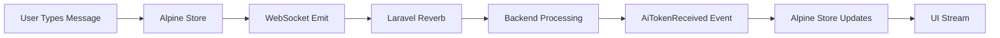

# WebSocket Implementation Complete ✅

## Files Changed/Created

| File | Action | Purpose |
|------|--------|---------|
| `resources/js/echo.js` | Created | Echo configuration for Reverb |
| `resources/js/app.js` | Updated | Alpine chat store & WebSocket integration |
| `resources/js/bootstrap.js` | Updated | Import echo module |
| `resources/views/layouts/app.blade.php` | Updated | Connection status indicator |
| `resources/views/livewire/agent-chat.blade.php` | Updated | WebSocket-powered chat UI |
| `vite.config.js` | Updated | Add echo.js entry |
| `WEBSOCKET_INTEGRATION.md` | Created | Full documentation |
| `WS_IMPLEMENTATION_SUMMARY.md` | Created | This file |

## How It Works



## Key Events

| Event | Trigger | Action |
|-------|---------|--------|
| `UserMessageSent` | User sends message | Add to UI immediately |
| `AiTokenReceived` | AI generates token | Append to response |
| `AiResponseComplete` | Response finished | Show stats |
| `lunaos:websocket-connected` | WS connected | Show green indicator |
| `lunaos:websocket-disconnected` | WS disconnected | Show red indicator |

## Testing

1. **Start Reverb**:
   ```bash
   cd /path/to/lunaos
   php artisan reverb:start
   ```

2. **Build Assets**:
   ```bash
   npm run build
   ```

3. **Start Server**:
   ```bash
   php artisan serve
   ```

4. **Open Chat**:
   - Navigate to `/chat` route
   - See "Connecting..." status
   - Connects when page loads
   - Send message → immediate appearance
   - AI response → token-by-token streaming

## Connection Status Indicators

- 🟡 Pulsing: **Connecting...** - Establishing WebSocket
- 🟢 Solid Green: **Connected** - WebSocket active
- 🔴 Solid Red: **Disconnected** - Connection lost

## Backend Requirements

The Laravel backend should emit these events:

```php
// In your Livewire component or event listener
event(new UserMessageSent($message, $timestamp));
event(new AiTokenReceived($token));
event(new AiResponseComplete($stats));
```

## Environment Variables

```env
BROADCAST_CONNECTION=reverb
REVERB_APP_ID=677219
REVERB_APP_KEY=hkgpejpfqogi6gg45kra
REVERB_APP_SECRET=8gqsf06jtxhxvleaw04r
REVERB_HOST=localhost
REVERB_PORT=8080
REVERB_SCHEME=http
```

## Next Steps

1. ✅ WebSocket connection established
2. ✅ User messages appear instantly
3. ✅ AI tokens stream in real-time
4. ⏳ Backend event emission (needs Laravel setup)
5. ⏳ Production SSL配置 (wss://)

## Browser Console Output

When working correctly:
```
✅ WebSocket connected
```

On error:
```
❌ WebSocket disconnected
```

---

**Status**: Frontend implementation complete  
**Ready for**: Backend event integration  
**Files to update next**: Your Laravel event listeners
